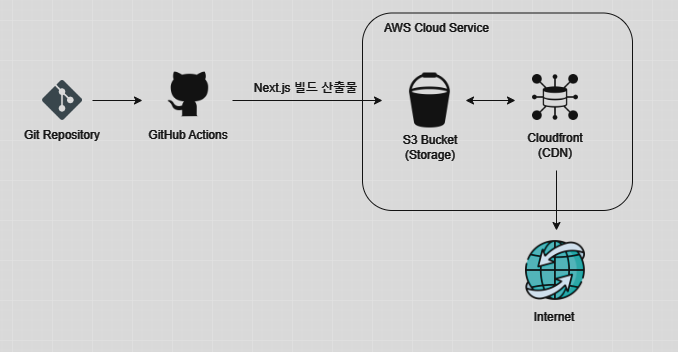
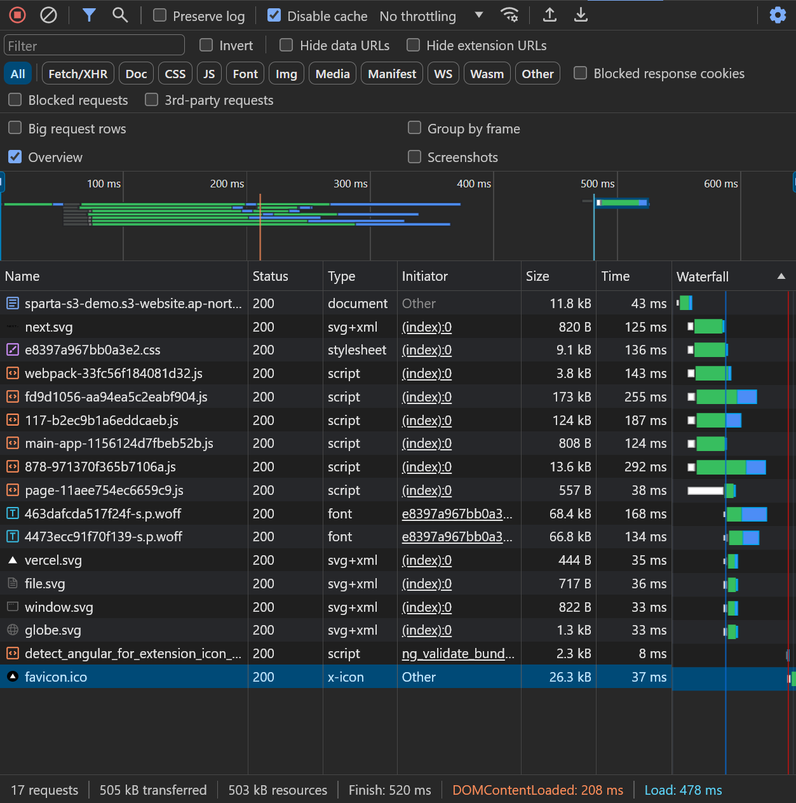
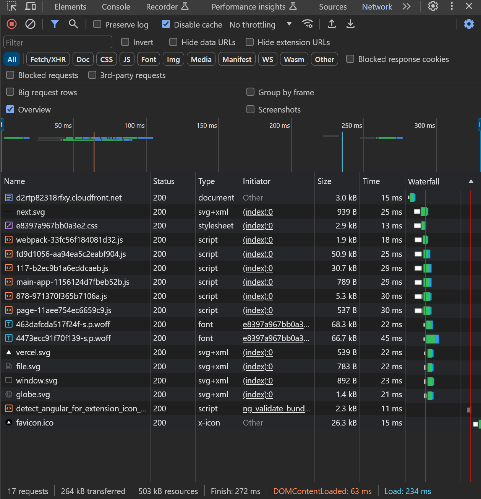

# 프론트엔드 배포 파이프라인

## 개요

GitHub Actions에 워크플로우를 작성해 다음과 같이 배포가 진행되도록 합니다.

1. 저장소를 체크아웃합니다.
2. Node.js 18.x 버전을 설정합니다.
3. 프로젝트 의존성을 설치합니다.
4. Next.js 프로젝트를 빌드합니다.
5. AWS 자격 증명을 구성합니다.
6. 빌드된 파일을 S3 버킷에 동기화합니다.
7. CloudFront 캐시를 무효화합니다.

---

## 주요 링크

- **S3 버킷 웹사이트 엔드포인트:**  
  `http://sparta-s3-demo.s3-website.ap-northeast-2.amazonaws.com`
- **CloudFront 배포 도메인 이름:**  
  `https://d2rtp82318rfxy.cloudfront.net`

---

## 주요 개념

- **GitHub Actions와 CI/CD 도구:**
  - GitHub Actions는 소스 코드 저장소의 변경 사항에 따라 자동으로 배포 워크플로우를 실행하는 CI/CD 도구입니다.
- **S3와 스토리지:**
  - S3는 AWS에서 제공하는 정적 파일(HTML, CSS, JS 등)을 저장하고 제공할 수 있는 안정적이고 확장 가능한 스토리지 서비스입니다.
  - S3를 정적 웹사이트 호스팅에 활용하면, Next.js나 React 같은 SPA(Single Page Application)를 배포할 때 간단히 설정할 수 있습니다.
  - 빌드된 정적 파일을 업로드하면 별도의 서버를 두지 않아도 웹사이트가 동작하며, 비용도 저렴합니다.
- **CloudFront와 CDN:**
  - CloudFront는 AWS에서 제공하는 CDN(Content Delivery Network) 서비스로, 전 세계 여러 엣지 로케이션에 파일을 캐싱하여 사용자에게 더 빠르게 콘텐츠를 제공할 수 있습니다.
  - 사용자의 위치에 따라 파일 전송 속도를크게 향상시킬 수 있고, 글로벌 사용자 기반 프로젝트에 필수적입니다.
- **캐시 무효화(Cache Invalidation):**
  - 배포 후에도 CloudFront에 캐싱된 이전 버전의 파일이 유지될 수 있습니다.
  - 캐시 무효화를 통해 CDN의 이전 버전 파일을 삭제하고 원본 서버에서 업로드된 파일로 다시 가져가도록 만들 수 있습니다.
  - 캐시 무효화는 AWS Console 또는 cli를 통해 GitHub Actions에서 배포 시 삭제하도록 설정할 수 있습니다.
  - [블로그 참고] `https://hyeon9mak.github.io/cloudfront-caching-control-with-invalidations/`
- **Repository secret과 환경변수:**
  - AWS 자격 증명(AWS_ACCESS_KEY_ID, AWS_SECRET_ACCESS_KEY)이나 CloudFront 배포 ID와 같은 민감한 정보를 안전하게 관리하기 위해 GitHub Repository secrets를 사용합니다.
  - GitHub에서 Repository - Settings - Secrets and variables - Actions 경로로 접근하여 Repository secrets를 설정할 수 있습니다.
  - 이렇게 저장된 Repository secrets는 워크플로우 설정 파일(이번 프로젝트의 경우 deployment.yml 파일)에서 `${{ secrets.<SECRET_NAME> }}`와 같은 형식으로 접근할 수 있습니다.
  - Repository secret은 수정 및 삭제는 가능하나 조회할 수 없습니다.
  - 팀 작업 시 민감한 정보가 코드에 노출되지 않도록 필수적으로 적용해야 합니다.
- **CDN과 성능 최적화:**
  - 원본 S3 서버로 요청 시
  
  - CloudFront CDN으로 요청 시
  
  - 첨부된 이미지 최하단 통계 데이터를 통해 성능 최적화 결과를 확인할 수 있습니다.
    - transferred 용량이 505kB에서 264kB로 감소
      - 캐싱으로 인해 서버로 요청하는 리소스의 수가 그만큼 줄어들었다는 것을 의미합니다.
      - Waterfall의 막대 개수가 줄어든 것 또한 같은 의미로 해석할 수 있습니다.
    - DOMContentLoaded 시간이 208ms에서 63ms로 감소
      - DOMContentLoaded 값은 DOM 구조가 완전히 로드된 시점까지의 시간을 의미합니다.
    - Load 시간이 478ms에서 234ms로 감소
      - Load 값은 페이지의 모든 리소스(HTML, CSS, JS, 이미지, 폰트 등)가 완전히 로드된 시점까지의 시간을 의미합니다.
    - finish 시간이 520ms에서 272ms로 감소
      - finish 값은 모든 네트워크 요청이 완료된 시점까지의 시간을 의미합니다.
  - 위 결과는 캐싱되는 데이터의 양이 많아질수록, 원본 서버와 요청 클라이언트 간의 물리적 거리가 멀어질수록 그 차이가 더 유의미하게 발생할 것입니다.
